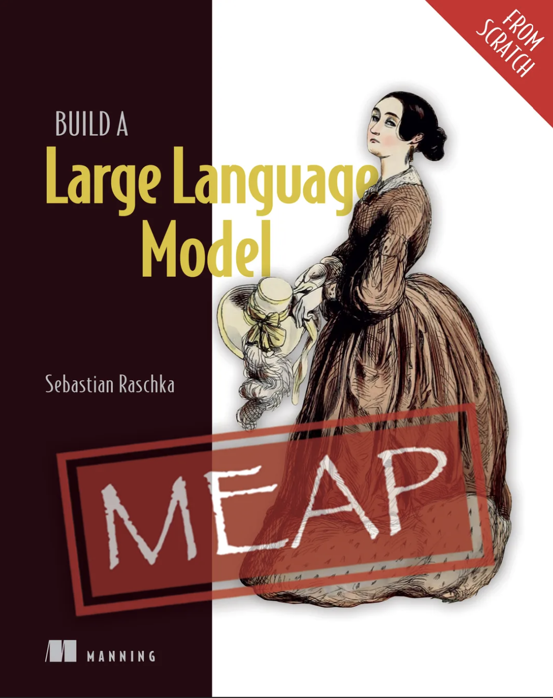

# Build a Large Language Model (From Scratch)  中文 jupyter 版

本项目是《Build a Large Language Model (From Scratch)》一书的中文 jupyter 版本，将[Build-A-Large-Language-Model-CN](https://github.com/skindhu/Build-A-Large-Language-Model-CN)的markdown文件转换为jupyter notebook的形式，可以边阅读边实践，有助于加深对大语言模型原理的理解。

## 大语言模型简介

大语言模型(Large Language Model, LLM)是一种基于深度学习的自然语言处理模型,通过在海量文本数据上进行预训练,可以理解和生成人类语言。它具有以下特点:

1. **规模庞大**: 模型参数量通常在数十亿到数千亿不等,需要大量计算资源进行训练。

2. **自注意力机制**: 采用 Transformer 架构中的自注意力机制,能够捕捉文本中的长距离依赖关系。

3. **预训练-微调范式**: 先在大规模无标注数据上进行预训练,再在特定任务上微调。

4. **强大的泛化能力**: 通过预训练获得了丰富的语言知识,可以迁移到各种下游任务。

5. **涌现能力**: 随着模型规模增大,会涌现出一些令人惊讶的新能力。

学习 LLM 的原理,不仅有助于理解 AI 如何模仿人类的语言处理能力,也为开发者提供了深入掌握模型训练、调优、部署等技术的机会。

本教程将带领读者从零开始实现一个简单的大语言模型,深入理解其工作原理。

## 项目结构

| 目录    | 说明                                                 |
| ------- | ---------------------------------------------------- |
| notebook  | 将中文版书籍转换为jupyter notebook的形式，可以边阅读边实践 |
| image   | 图片文件，与书中内容一一对应                          |

### 全书章节

+ [第一章：理解大语言模型](./notebook/1.理解大语言模型.ipynb)
+ [第二章：处理文本数据](./notebook/2.处理文本数据.ipynb)
+ [第三章：实现注意力机制](./notebook/3.实现注意力机制.ipynb)
+ [第四章：从零开始实现一个用于文本生成的 GPT 模型](./notebook/4.从零开始实现一个用于文本生成的GPT模型.ipynb)
+ [第五章：在无标记数据集上进行预训练](./notebook/5.在无标记数据集上进行预训练.ipynb)
+ [第六章：用于分类任务的微调](./notebook/6.用于分类任务的微调.ipynb)
+ [第七章：指令遵循微调](./notebook/7.指令遵循微调.ipynb)
+ [附录A：PyTorch简介](./notebook/附录A.PyTorch简介.ipynb)
+ [附录B：参考文献和扩展阅读](./notebook/附录B.参考文献和扩展阅读.ipynb)
+ [附录C：习题解答](./notebook/附录C.习题解答.ipynb)
+ [附录D：给训练循环添加高级技巧](./notebook/附录D.给训练循环添加高级技巧.ipynb)
+ [附录E：使用 LoRA 的参数高效微调](./notebook/附录E.使用LoRA的参数高效微调.ipynb)

## 个人思考

巴克莱在最近发布的研报中提出了一份“AI路线图”，描绘了未来AI技术应用的演进路径，我个人比较认同。报告指出，AI的应用将经历三个重要阶段，首先是当下的**第一阶段**：聊天机器人和早期的AI助理（Copilot），因为目前主要是侧重于基础设置的建设和模型能力的竞赛。接下来在2025-2026年将迎来“真AI代理时代”的人**第二阶段**，这一阶段的核心在于能够自主完成任务的AI代理的广泛应用。与聊天机器人和Copilot不同，AI代理能完成相对复杂的任务，尽量减少人类的直接干预。而在2027年以后，AI技术将进一步进入“数字员工与机器人时代”**第三阶段**”（应该是所谓的具身智能），在企业应用中，AI代理可能演变成独立完成任务的“数字员工”，在消费者市场，智能机器人将开始逐步融入家庭生活，承担简单和重复性的日常任务。

可以看到，这一发展趋势的推断依据是人类对于AI工作过程的介入越来越少（意味着AI能力越来越强），再结合具身形态，必然会帮人类承担越来越多的工作。据巴克莱估计，到这一阶段，AI技术的普及将达到互联网用户的规模，突破40亿人。

**那么作为IT从业者，从现在开始应该做哪些准备尽量保障自己在将来不会被淘汰，根据我的浅薄认知做一下梳理和预测：**

+ **持续学习与技能提升**

  + 尽量去掌握大模型技术原理，而不要仅仅关注各种花里胡哨的应用层面的资讯。学习原理，才能透过现象看本质，比如该项目从零到一通过编码的方式带我们了解如何准备和清理训练数据、分词、词嵌入、Transformer架构的实现、模型精调、实现指令遵循等，对于大模型的理解非常有帮助。
  + 保持和加深对业务的理解：AI最终是要落地到实际的业务中去解决某一类问题，那么如何对业务问题进行抽象从而设计出高效的AI工作流是我们要关注和解决的问题，这也取决于我们对业务的理解程度。

+ **拥抱AI工具和技术**

  + 多在日常的工作和生活中使用各类AI工具，这样才能逐渐对各种不同的AI应用思路的认知提升。
  + 多参与实际的AI项目，积累经验，从中学习如何将AI应用到实际的问题中，提升解决问题的能力。

+ **够快速适应变化**

  + 尽量保持开放的形态，不要因为年龄慢慢变大，生活中琐事变多而失去好奇心。我们要对新技术、新工具保持好奇和开放的态度，快速适应技术的变化和市场的需求。

  + 接受未来可能带来的变化，积极寻找学习和发展的机会。

